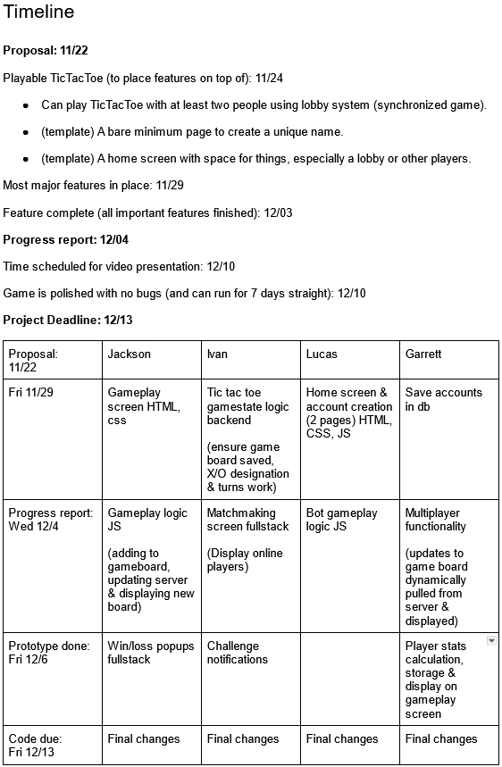
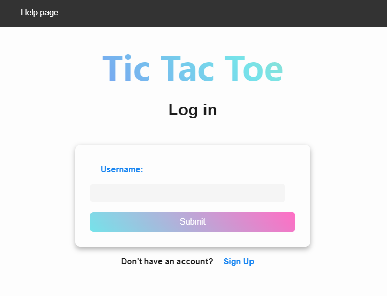
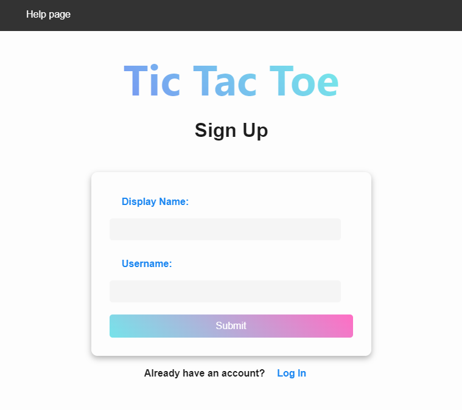
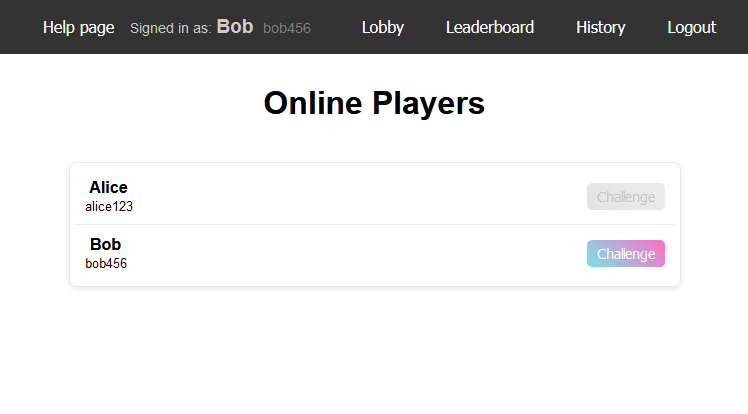
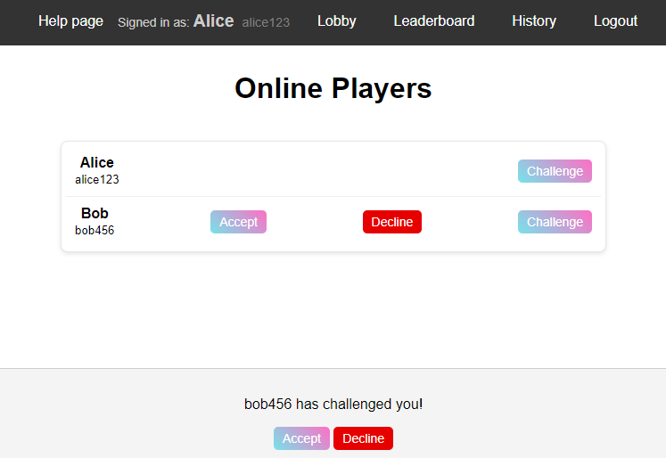
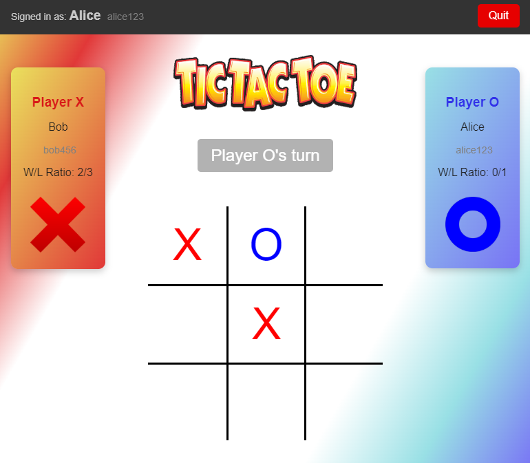
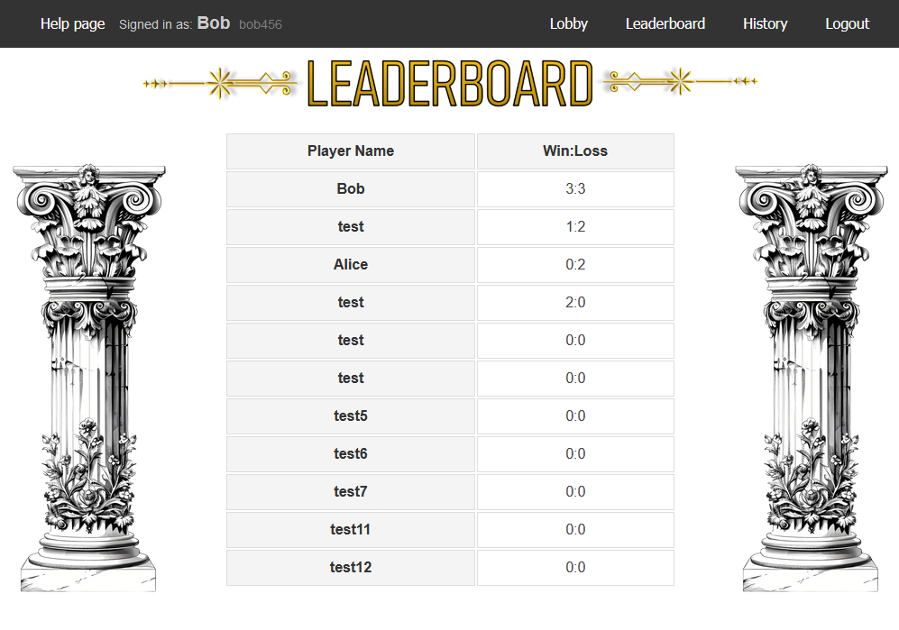
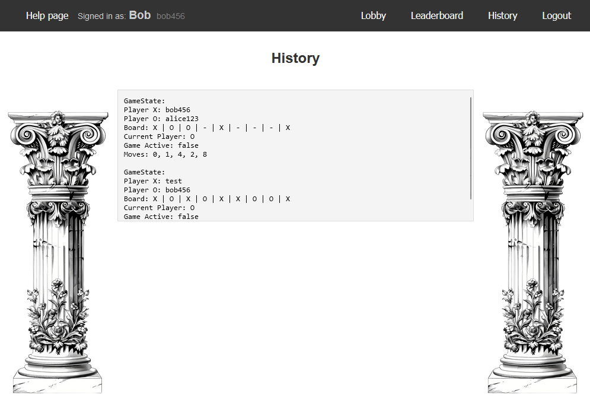
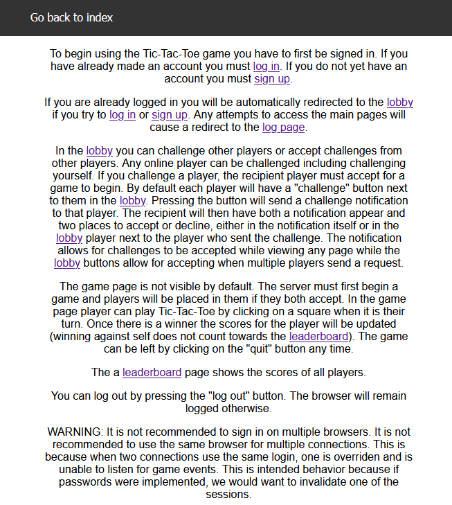
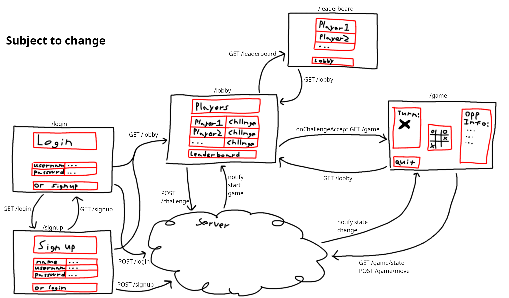

# csc337-final-project
Final project for CSC 337 - Web Development

| Contributors      |
| ----------------- |
| Ivan Gusachenko   |
| Garrett Scott |
| Jackson Grove |
| Lucas Dargert |
## Run instructions
The easiest way to run the project is using Docker. With docker installed on the machine the project can be deployed using the command:
```bash
# Make sure your docker services are running.
# For example on Windows it's necessary to open the docker executable to start the service and avoid errors.
docker-compose up --build
```
This brings down the docker container while keeping account data.
```bash
docker-compose down
```
This deletes the database and all accounts:
```bash
# Warning, deletes data!!!
docker-compose down --volumes
```
Additionally Ctrl-C can be used to bring down the container while keeping accounts or the provided tools from the Docker executable or IDE can be used instead to manage the containers.

**Note**: **The [General Requirements](#General-Requirements) fulfillment are near the bottom before the [gallery](#Gallery)**

## Overview
This project implements a network multiplayer Tic Tac Toe game. Users are able to log into the service an pick another user to play against. Users can play in real time. Each user account will store statistics vs another player and their overall wins:losses. The user can optionally play against themselves.

## Frontend
<p>
    To begin using the Tic-Tac-Toe game you have to first be signed in. If you have already made an account you must <a href='public/login.html'>log in</a>. If you do not yet have an account you must <a href="public/signup.html">sign up</a>.
</p>
<p>
    If you are already logged in you will be automatically redirected to the <a href="public/lobby.html">lobby</a> if you try to <a href='public/login.html'>log in</a> or <a href="public/signup.html">sign up</a>. Any attempts to access the main pages will cause a redirect to the <a href='public/login.html'>log page</a>.
</p>
<p>
    In the <a href="public/lobby.html">lobby</a> you can challenge other players or accept challenges from other players. Any online player can be challenged including challenging yourself. If you challenge a player, the recipient player must accept for a game to begin. By default each player will have a "challenge" button next to them in the <a href="public/lobby.html">lobby</a>. Pressing the button will send a challenge notification to that player. The recipient will then have both a notification appear and two places to accept or decline, either in the notification itself or in the <a href="public/lobby.html">lobby</a> player next to the player who sent the challenge. The notification allows for challenges to be accepted while viewing any page while the <a href="public/lobby.html">lobby</a> buttons allow for accepting when multiple players send a request.
</p>
<p>
    The game page is not visible by default. The server must first begin a game and players will be placed in them if they both accept. In the game page player can play Tic-Tac-Toe by clicking on a square when it is their turn. Once there is a winner the scores for the player will be updated (winning against self does not count towards the <a href="public/leaderboard.html">leaderboard</a>). The game can be left by clicking on the "quit" button any time.
</p>
<p>
    The a <a href="public/leaderboard.html">leaderboard</a> page shows the scores of all players.
</p>
<p>
    You can log out by pressing the "log out" button. The browser will remain logged otherwise.
</p>
<p>
    WARNING: It is not recommended to sign in on multiple browsers. It is not recommended to use the same browser for multiple connections. This is because when two connections use the same login, one is overriden and is unable to listen for game events. This is intended behavior because if passwords were implemented, we would want to invalidate one of the sessions.
</p>

The [gallery](#Gallery) is at the bottom of the README (this document) with images of various pages and situations as well as an early diagram drawn of what the project should look like in the brainstorming stage.

## Backend

The modules used were express, mongodb, and mongoose. A few others were used but were not as critical as the previous (dotenv and cookie-parser). The backend is primarily responsible for handling the gamestate and coordinating the players. The gamestate is stored on the server and can only be modified by the server. The players are able to request a move which the server can either permit or reject. The server coordinates players through the challenge data it stores and the player data it stores. If a player wants to play a game of tictactoe they must challenge another player (or themselves) to begin a challenge event that when accepted by both parties will lead to a game starting.

POST requests are handled most of the time when the player needs to send data. GET requests are used to either get a page or used like an API to get information about the game/leaderboard/etc.. There are a large amounts of routes that can be used. The critical ones are /signup, /login, /lobby, /leaderboard, /history, /tictactoe, /game/state, and /game/move. More routes exist but they are either edge cases or auxiliary.

Each player consists of a name and a username as well as additional information such as wins and losses. The team has ultimately decided we do not wish to continue supporting passwords so clients are expected to be honest when it comes to their username. However, if they do not provide a valid username the server will reject requests if an action requires permission.

## Reflections

The project itself went well. Scheduling did not work as time was extremely limited for many groupmates. The fluid approach with the expectation and planning to switch between roles and pick up where others left off helped with maintaining progress without slowdowns. The initial brainstorm and final product match very closely. While this isn't an indication of a good result, it is an indication of the organization going into the project. Most features were implemented. Some were added during the development cycle. While other features were scrapped because they were either replaced or deemed not to be important.

## Timeline

The timeline was mostly followed and deadlines were purposefully set early to account for potential setbacks.

Along with the original proposal there are notes on what was done on what days <a href="docs/hoursLogIvan.txt">here in this text file</a>.

Hours may not have been accurately logged since they are mostly coming from Github commit timestamps and do not accurately include meetings, discussions, and small/sparse contributions.



## General Requirements

* The project is of significant scale and complexity. Although it may be a TicTacToe game. It covers the concepts covered in class and has a lot of moving components. The TicTacToe aspect is only a foundation or idea from which we can add features to. Since the TicTacToe game is multiplayer it automatically requires a lot of NodeJS and JavaScript code to facilitate communications between the server and client.

* * Although not strictly tracked the time debugging, communicating, and writing the code likely surpassed 60 hours since over 40 hours can be counted from repository commits alone. (20 hours debugging and communicating may not have been tracked well).

* The website allows for account creation. Specifically with a name and username. It is not expected to be secure and although we did look into passwords and implemented a working and secure version, it was not worth the support needed (since it isn't relevant to what we need to do and what we need to demonstrate).

* The website allows interaction in various ways. For one, the players can see each other because it shows who is online. The players can also challenge each other and see the notifications in realtime. The TicTacToe game also gives realtime interaction. Server-Side Events were used instead of Websockets. There is a leaderboard which also counts as interaction between players.

* Going into this project there is client-side JavaScript and NodeJS in the backend.

* The server makes use of NodeJS, express, mongoDB, and mongoose. A few more modules were used, namely cookie-parser and dotenv but they are only auxiliary and can likely be replaced with an hour of work.

* The database contains a lot of differing data. First there is the name and username it keeps track of. Next is the scores. Finally it has the gamestate and all of its associated values. Additionally, there is the ability to store player challenges themselves however we do not have a need for that so the database does not have to keep track of that.

* The front-end uses HTML, CSS, and JS. No framework was used.

* There is a <a href="public/help.html">help page</a> provided by the server. It explains a little bit about how to use the service. The button will be on the top-right (excluded when in a game to avoid leaving the other player mid-game). It's obvious in the sense that if someone is trying to click everything it's probably the first thing they will see and click on. It's not the main focus of the application so it was strategically placed to not draw focus but also be simple to spot when needed.

## Gallery:

Login page:


Signup page:


Lobby challenge example:


Lobby challenged example:


Game in progress:


Leaderboard Page:


History Page:


Help Page:


Early sketch of routes:

